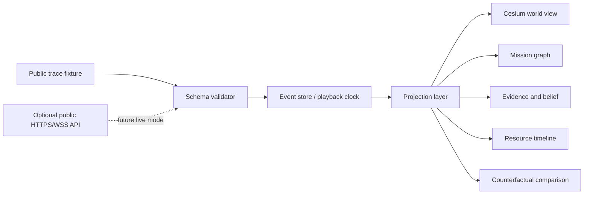

# Public Showcase Architecture

## Principle

The Showcase is a static-first browser application. It renders a mission from an ordered public event trace and remains fully useful without access to the private core or a live backend.



## Planned repository architecture

```text
apps/web/
  application shell, routes, modes, composition

packages/contracts/
  public JSON Schema and validation

packages/domain/
  event ordering, playback, projections, comparison

packages/cesium-adapter/
  Cesium entities, CZML, camera, asset lifecycle

packages/ui/
  design tokens and domain components

public/fixtures/
  small public traces and manifests
```

The first implementation may start with fewer packages, but these dependency directions must hold:

- domain does not import React, Cesium, or ECharts;
- Cesium adapter consumes projection objects, not private/core objects;
- UI never mutates canonical events;
- static fixtures and future live events pass through the same validator and projection pipeline.

## Static mode

Static mode loads a local manifest and trace, verifies the schema version, constructs projections, and controls the clock entirely in the browser. It is the default GitHub Pages mode and the basis for deterministic visual tests.

## Future live mode

Live mode may receive ordered events from a narrow HTTPS/WebSocket API. It must support reconnect from `after_seq`, detect gaps, and clearly display simulation versus live/replayed status. Static mode remains available as fallback.

## Why not Open MCT as the shell

Open MCT is a useful reference and possible future telemetry view adapter. The Showcase owns a different primary information architecture: mission intent, evidence, belief, action causality, resource tradeoffs, and counterfactual outcomes. A telemetry framework should not define that product story.

## Why Cesium is behind an adapter

Cesium is the planned 3D/time-dynamic rendering engine, but the mission trace is renderer-neutral. Keeping Cesium behind an adapter makes deterministic projection tests possible and prevents graphics state from becoming mission state.

