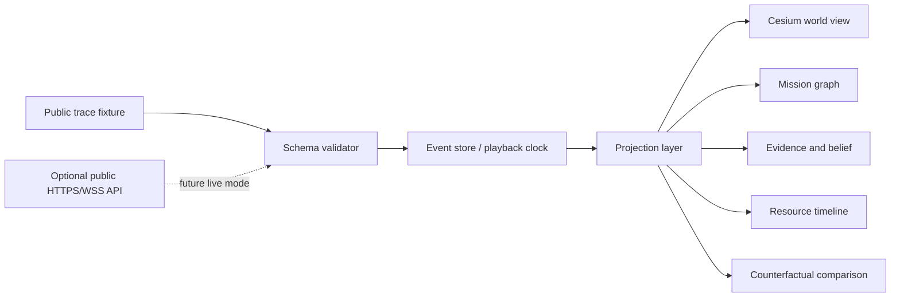

# Public Showcase 架构

## 原则

Showcase 是一个静态优先（static-first）的浏览器应用。它根据一条有序的 public event trace 渲染任务，并且在无法访问私有 core 或实时后端时，仍能完整发挥作用。



## 规划中的仓库架构

```text
apps/web/
  application shell, routes, modes, composition

packages/contracts/
  public JSON Schema and validation

packages/domain/
  event ordering, playback, projections, comparison

packages/cesium-adapter/
  Cesium entities, CZML, camera, asset lifecycle

packages/ui/
  design tokens and domain components

public/fixtures/
  small public traces and manifests
```

第一次实现可以从更少的 package 开始，但必须保持以下依赖方向：

- domain 不得导入 React、Cesium 或 ECharts；
- Cesium adapter 消费 projection object，而不是私有/core object；
- UI 永不修改 canonical event；
- 静态 fixture 和未来的实时 event 必须经过同一套 validator 与 projection pipeline。

## Static mode

Static mode 加载本地 manifest 和 trace，校验 schema version，构建 projection，并完全在浏览器内控制时钟。它是默认的 GitHub Pages 模式，也是 deterministic visual test 的基础。

## 未来的 Live mode

Live mode 可以从一个范围受限的 HTTPS/WebSocket API 接收有序 event。它必须支持通过 `after_seq` 断点重连、检测序列缺口，并清楚标明当前是 simulation、live 还是 replayed 状态。Static mode 仍须作为 fallback 保留。

## 为什么不以 Open MCT 作为 shell

Open MCT 是有价值的参考，也可能在未来作为 telemetry view adapter 使用。Showcase 拥有不同的核心 information architecture：mission intent、evidence、belief、action causality、resource tradeoff 和 counterfactual outcome。telemetry framework 不应定义这套产品叙事。

## 为什么将 Cesium 隔离在 adapter 之后

Cesium 是规划中的 3D/时间动态渲染引擎，但 mission trace 与 renderer 无关。将 Cesium 隔离在 adapter 之后，可以实现 deterministic projection test，并避免图形状态演变成 mission state。
